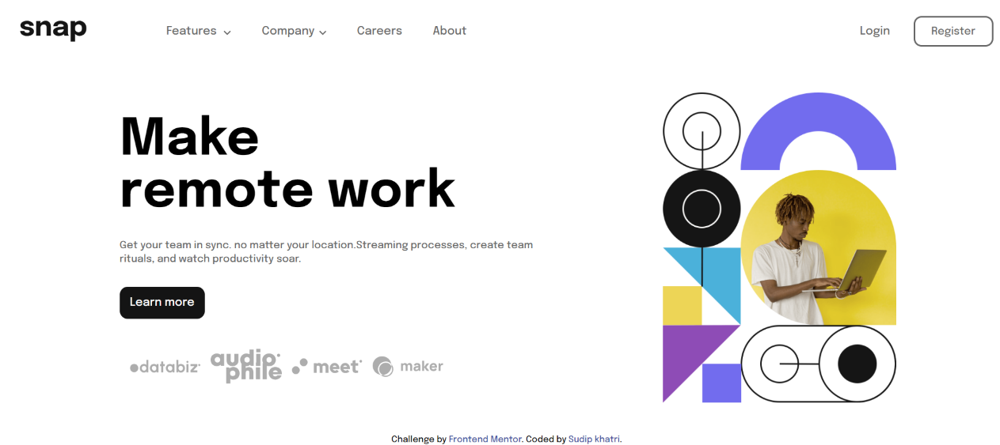

# Frontend Mentor - Intro section with dropdown navigation solution

This is a solution to the [Intro section with dropdown navigation challenge on Frontend Mentor](https://www.frontendmentor.io/challenges/intro-section-with-dropdown-navigation-ryaPetHE5). Frontend Mentor challenges help you improve your coding skills by building realistic projects.

## Table of contents

- [Overview](#overview)
  - [The challenge](#the-challenge)
  - [Screenshot](#screenshot)
  - [Links](#links)
- [My process](#my-process)
  - [Built with](#built-with)
  - [What I learned](#what-i-learned)
  - [Continued development](#continued-development)
- [Author](#author)

## Overview

### The challenge

Users should be able to:

- View the relevant dropdown menus on desktop and mobile when interacting with the navigation links
- View the optimal layout for the content depending on their device's screen size
- See hover states for all interactive elements on the page

### Screenshot

### Links

- Solution URL: [Add solution URL here](https://your-solution-url.com)
- Live Site URL: [https://introsectionwithdropdownfrontend.netlify.app/](https://introsectionwithdropdownfrontend.netlify.app/)

## My process

### Built with

- Semantic HTML5 markup
- CSS custom properties
- Flexbox
- Responsive Webpage
- Vanilla Javascript

### What I learned

By doing this challenge I learned to make responsive navigation bar with dropdown also learned to add overlay while opening nav menu

### Continued development

I want to continue focusing on responsive website with different types of navbar and aside section. Make it interactive for users and adding differnet styles , overlay and transition effect.

## Author

- Linkedin - [@Sudip khatri](https://www.linkedin.com/in/sudip-khatri-a72a6a27b/)
- Frontend Mentor - [@SudipKhatri036](https://www.frontendmentor.io/profile/SudipKhatri036)
- Github - [@SudipKhatri036](https://github.com/SudipKhatri036)
