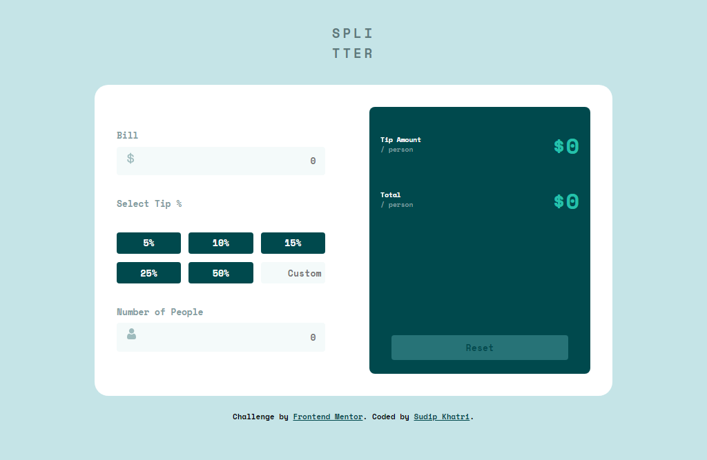

# Frontend Mentor - Tip calculator app solution

This is a solution to the [Tip calculator app challenge on Frontend Mentor](https://www.frontendmentor.io/challenges/tip-calculator-app-ugJNGbJUX). Frontend Mentor challenges help you improve your coding skills by building realistic projects.

## Table of contents

- [Overview](#overview)
  - [The challenge](#the-challenge)
  - [Screenshot](#screenshot)
  - [Links](#links)
- [My process](#my-process)
  - [Built with](#built-with)
  - [What I learned](#what-i-learned)
  - [Continued development](#continued-development)
  - [Useful resources](#useful-resources)
- [Author](#author)
- [Acknowledgments](#acknowledgments)

**Note: Delete this note and update the table of contents based on what sections you keep.**

## Overview

### The challenge

Users should be able to:

- View the optimal layout for the app depending on their device's screen size
- See hover states for all interactive elements on the page
- Calculate the correct tip and total cost of the bill per person

### Screenshot

### Links

- Solution URL: [Add solution URL here](https://your-solution-url.com)
- Live Site URL: [[(https://frontendmentortipcalculatorapp.netlify.app/)](https://frontendmentortipcalculatorapp.netlify.app/)

## My process

### Built with

- Semantic HTML5 markup
- CSS custom properties
- Flexbox
- CSS Grid
- Mobile-first workflow

### What I learned

I learned grid symantic html improved my coding and best pracitce for coding and learned to make responsive website. I also learned to position element responsively and catched all the posibble error while filling the tip calculator form and handled the error.

### Continued development

I want to continue focusing on responsive website with good javascript coding . I am still not fully comfortable with the coding in javascript in a clean and best manner soon i will improve in this by gaining experience by practicing more and more projects. I also want to refine and continue focusing on grid layout . I am still not so good in grid and i am learning it more and more through projects.

### Useful resources

- [resource 1](https://stackoverflow.com/) - This helped me for removing active class from tip percent button while i clicked other i wanted to remove the active class from the old one . I really liked this pattern and will use it going forward.
- [resource 2](https://chat.openai.com/) - This is an amazing website which helped me finally understand the concept to stop the event bubling also working in outside the button. I'd recommend it to anyone still learning this concept.

## Author

- Frontend Mentor - [@yourusername](https://www.frontendmentor.io/profile/SudipKhatri036)
- Linkedin - [@Sudip Khatri](https://www.linkedin.com/in/sudip-khatri-a72a6a27b/)

## Acknowledgments

Chat gpt and stackoverflow is very helpful for using it as a like as asking in google it helps a lot
